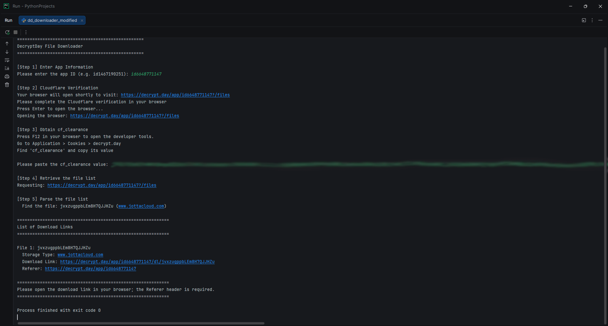
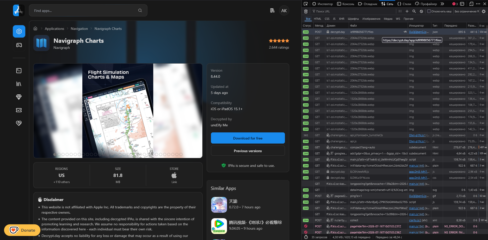
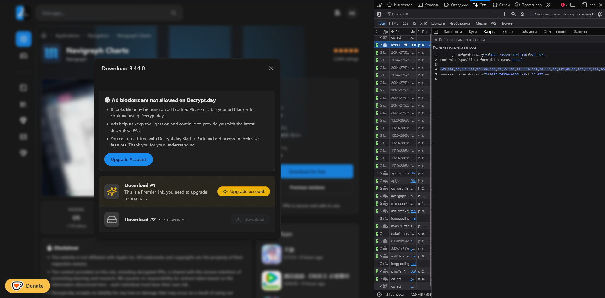
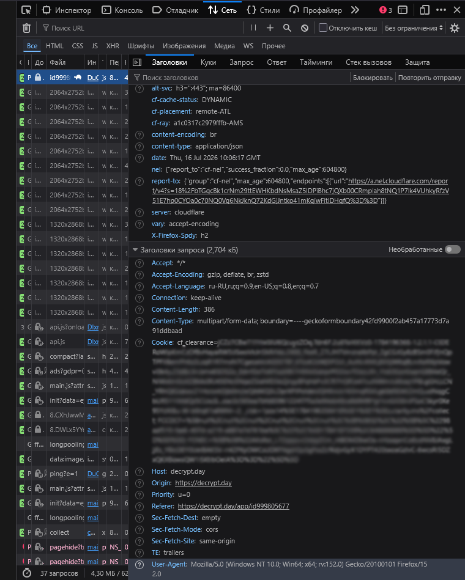
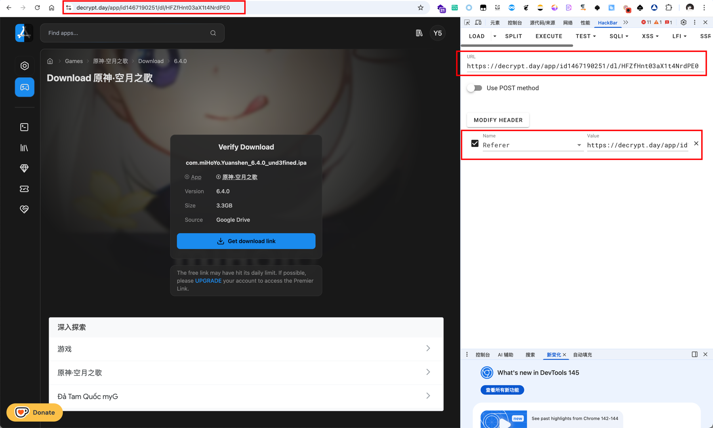
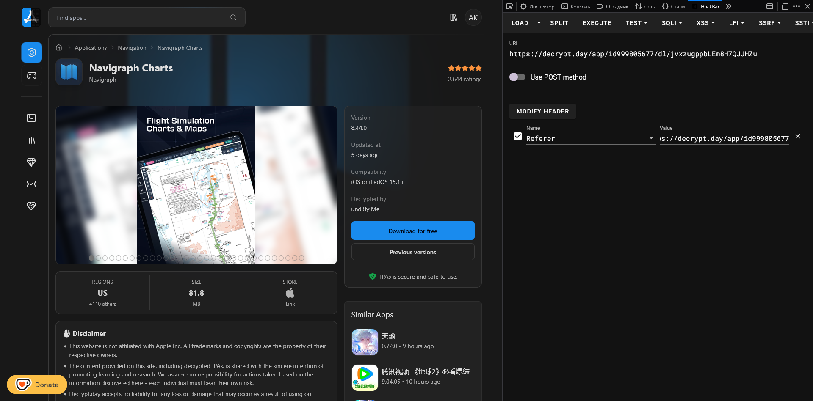

# MANUAL
## What is it?
Whenever I try to download anything from Decrypt.day, I keep getting an error from the ad blocker. A huge thanks to [Y5neKO](https://github.com/Y5neKO) for the script that lets us get around this. This repository is a fork of the original [Y5neKO DecryptDayDownloader](https://github.com/Y5neKO/DecryptDayDownloader). I just translated it into English to make it easier to use.

The script has been tested in Chrome and Firefox. Personally, I use Firefox.

An example of a successful script execution:

I use the PyCharm IDE to run and edit scripts.

## First things first
### You need to fill in the "User-Agent" and "form_data" fields in the script.
1. Open the page with the app you want to download.
2. Open Dev Tools by pressing F12.
3. Go to the "Network" tab and clear it (in Firefox, this is the trash can icon in the top-left corner).
4. Click the "Download for free" button to generate new requests.
5. You’re interested in the POST request that refers to "your_app_id"?/files (it’s usually the very first one).
6. Click on it, and in the "Request" field, you’ll see the request payload. Here, you need to copy the entire string containing numbers and paste it into the "form_data" field in the script file.

The desired line:

You can also find your "User-Agent" value here in the “Headers” tab by scrolling all the way to the bottom:

IMPORTANT! The script contains two User-Agent fields; you must fill in both.

## Launch
Now you can run the script (in PyCharm: right-click -> run "script_name").

When prompted to enter the application ID, you can copy it from the browser's address bar (example: id123456789).

Next, you'll need to enter the value of your session cookie. Here's how to do it in Firefox:
1. Reopen Dev Tools if you closed it (press F12).
2. Go to the "Storage" tab.
3. Find the field labeled "cf_clearance" and copy its value (double-clicking will help select the entire value field).

## Installation
If you've done everything correctly, you should see the available download links.

### Extension
Next I recommend installing the HackBar extension to edit query parameters. I use [this one](https://addons.mozilla.org/ru/firefox/addon/firefox-hackbar/) (it’s also available in Chrome). Or you can download it from the GitHub repository if that’s more convenient for you: [hackbar](https://github.com/0140454/hackbar/releases/tag/v1.2.8).

The HackBar tab should now appear in Dev Tools.

### Downloading
You're now in the home stretch. Follow these final steps:
1. Copy one of the download links and paste it into your browser.
2. Open Dev Tools again and go to the HackBar tab.
3. Enter the same download link in the URL field.
4. Click the "MODIFY HEADER" button, select "Referer" from the drop-down list and paste the second (Referer) link provided by the script into the "Value" field.
5. Click "EXECUTE" button.

You should now see a window with a link to download what you need.

## Conclusion
I hope this guide was helpful. Enjoy!

