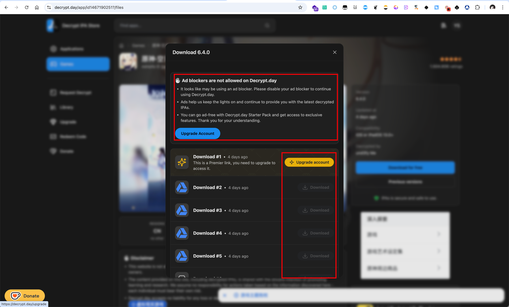
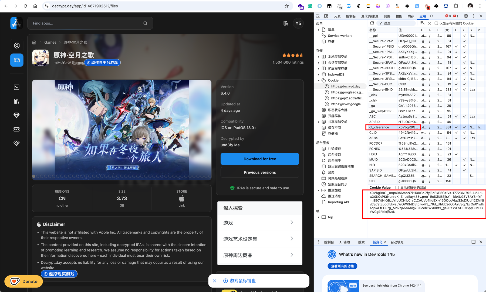

# README

decrypt.day下载砸壳ipa的时候经常遇到广告拦截后获取不到下载链接的情况，类似chrome这种自带拦截的又关不掉，非常麻烦，简单写了个脚本来半自动获取下载链接



## 半自动脚本

直接运行


## 手动获取

### 获取 cf_clearance



### 获取文件列表

#### HTTP

```http request
POST /app/id1467190251?/files HTTP/1.1
Host: decrypt.day
Accept: */*
Accept-Encoding: gzip, deflate, br, zstd
Accept-Language: zh-CN,zh;q=0.9,en-US;q=0.8,en;q=0.7,ja;q=0.6,zh-TW;q=0.5
Cache-Control: no-cache
Pragma: no-cache
Content-Type: multipart/form-data; boundary=----WebKitFormBoundaryh7BXBC9F3IBfdTRw
Content-Length: 349
Origin: https://decrypt.day
Referer: https://decrypt.day/app/id1467190251
User-Agent: Mozilla/5.0 (Macintosh; Intel Mac OS X 10_15_7) AppleWebKit/537.36 (KHTML, like Gecko) Chrome/145.0.0.0 Safari/537.36
Sec-Fetch-Site: same-origin
Sec-Fetch-Mode: cors
Sec-Fetch-Dest: empty
Sec-CH-UA: "Not:A-Brand";v="99", "Google Chrome";v="145", "Chromium";v="145"
Sec-CH-UA-Full-Version: "145.0.7632.76"
Sec-CH-UA-Full-Version-List: "Not:A-Brand";v="99.0.0.0", "Google Chrome";v="145.0.7632.76", "Chromium";v="145.0.7632.76"
Sec-CH-UA-Platform: "macOS"
Sec-CH-UA-Platform-Version: "15.7.1"
Sec-CH-UA-Arch: "arm"
Sec-CH-UA-Bitness: "64"
Sec-CH-UA-Mobile: ?0
Priority: u=1, i
Cookie: cf_clearance=ifpkRcxJ0h2x1omPT5mBWxuG4PTayy5B03S4buMN9c4-1772366056-1.2.1.1-byOxO5Ke3xU.mqRhZbI3OKeP112TIFfQLC64xb7OxV1fjtwMLbU2aXPfEGfj2NjPAmXevs2uTvjp1Tk.pQkA6Kd.U52LoDE5gtvV4zMiusbN6fpQaKSqR9kVLz8VeTCZe1CgM43iCUSMNMyjSDrirJD2oCz.6R8cghAJRQv1SdkKR.3x.0fbEOs40SU77cL_KOXRsxvcrNUKzE6TGIvmGRdUhYU61MLXmyjqq5CQJd1KitYrnUt1FH3nCglIMJlv

------WebKitFormBoundaryh7BXBC9F3IBfdTRw
Content-Disposition: form-data; name="data"

163,101,97,112,112,73,100,120,25,99,108,57,115,101,52,48,116,55,48,48,53,53,100,111,102,119,49,120,111,54,49,109,119,120,103,118,101,114,115,105,111,110,101,54,46,52,46,48,105,105,115,80,114,101,109,105,101,114,247
------WebKitFormBoundaryh7BXBC9F3IBfdTRw--
```

#### CURL

```shell
curl -X POST "https://decrypt.day/app/id1467190251?/files" \
  -H "Accept: */*" \
  -H "Accept-Language: zh-CN,zh;q=0.9,en-US;q=0.8,en;q=0.7,ja;q=0.6,zh-TW;q=0.5" \
  -H "Cache-Control: no-cache" \
  -H "Pragma: no-cache" \
  -H "Origin: https://decrypt.day" \
  -H "Referer: https://decrypt.day/app/id1467190251" \
  -H "User-Agent: Mozilla/5.0 (Macintosh; Intel Mac OS X 10_15_7) AppleWebKit/537.36 (KHTML, like Gecko) Chrome/145.0.0.0 Safari/537.36" \
  -H 'Cookie: cf_clearance=ifpkRcxJ0h2x1omPT5mBWxuG4PTayy5B03S4buMN9c4-1772366056-1.2.1.1-byOxO5Ke3xU.mqRhZbI3OKeP112TIFfQLC64xb7OxV1fjtwMLbU2aXPfEGfj2NjPAmXevs2uTvjp1Tk.pQkA6Kd.U52LoDE5gtvV4zMiusbN6fpQaKSqR9kVLz8VeTCZe1CgM43iCUSMNMyjSDrirJD2oCz.6R8cghAJRQv1SdkKR.3x.0fbEOs40SU77cL_KOXRsxvcrNUKzE6TGIvmGRdUhYU61MLXmyjqq5CQJd1KitYrnUt1FH3nCglIMJlv' \
  -F 'data=163,101,97,112,112,73,100,120,25,99,108,57,115,101,52,48,116,55,48,48,53,53,100,111,102,119,49,120,111,54,49,109,119,120,103,118,101,114,115,105,111,110,101,54,46,52,46,48,105,105,115,80,114,101,109,105,101,114,247'
```


### 获取下载链接


随机挑选拼接

https://decrypt.day/app/id1467190251/dl/HFZfHnt03aX1t4NrdPE0

### 访问下载链接

需要带上对应的referer

https://decrypt.day/app/id1467190251


